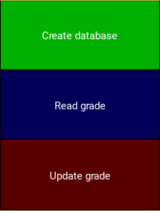

<!DOCTYPE html>
<html lang="es">
<head>
    <meta charset="UTF-8">
    <meta name="viewport" content="width=device-width, initial-scale=1.0">
    <meta name="description" content="EVAP - Sistema de Evaluación Estudiantil para la gestión y evaluación eficiente de estudiantes con Python y KivyMD.">
    <title>EVAP - Sistema de Evaluación Estudiantil</title>
    <link rel="icon" type="image/x-icon" href="favicon.ico">
    
</head>

<body>
    <header role="banner" aria-label="Encabezado de EVAP">
        <h1>EVAP</h1>
        
Sistema de Evaluación Estudiantil

    </header>
    <main>
        
        
        
        
             
              
        
        <section aria-labelledby="descripcion">
            <h2 id="descripcion">Descripción</h2>
            
EVAP es una aplicación profesional diseñada para facilitar la gestión y evaluación de estudiantes. Desarrollada con Python y KivyMD, ofrece una interfaz moderna e intuitiva para administrar información académica de manera eficiente.

        </section>
        <section aria-labelledby="caracteristicas" class="features">
            <h2 id="caracteristicas">Características</h2>
            <ul role="list" class="features">
                <li class="feature-card">
                    <h3>Gestión de Estudiantes</h3>
                    
Registro completo de estudiantes con nombres, apellidos, cédula de identidad y correo electrónico.

                </li>
                <li class="feature-card">
                    <h3>Sistema de Calificaciones</h3>
                    
Asignación y edición de notas por práctica, con cálculo automático de promedio y acumulados.

                </li>
                <li class="feature-card">
                    <h3>Base de Datos Segura</h3>
                    
Almacenamiento local con SQLite, garantizando integridad y disponibilidad de los datos.

                </li>
                <li class="feature-card">
                    <h3>Interfaz Intuitiva</h3>
                    
Diseño responsive y accesible, con transiciones fluidas entre pantallas.

                </li>
            </ul>
        </section>
        <section aria-labelledby="caracteristicas-principales">
            <h2 id="caracteristicas-principales">Características Principales</h2>
            <ul>
                <li><strong>Creación de base de datos</strong> con información completa de estudiantes.</li>
                <li><strong>Visualización detallada</strong> de registros estudiantiles.</li>
                <li><strong>Edición avanzada</strong> de calificaciones con validación de datos.</li>
                <li><strong>Sistema de promedios</strong> automático.</li>
                <li><strong>Validación de campos</strong> para garantizar datos correctos.</li>
                <li><strong>Mensajes de feedback</strong> para operaciones exitosas o errores.</li>
            </ul>
        </section>
        <section aria-labelledby="capturas-pantalla">
            <h2 id="capturas-pantalla">Capturas de Pantalla</h2>
            

                

                    
                    
Pantalla Principal

                

                

                    
                    
Creación de Base de Datos

                

                

                    
                    
Registro de Estudiantes

                

            

        </section>
        <section aria-labelledby="tecnologias">
            <h2 id="tecnologias">Tecnologías Utilizadas</h2>
            <ul class="tech-stack" role="list">
                <li class="tech-item">Python Lenguaje principal</li>
                <li class="tech-item">KivyMD Interfaz gráfica</li>
                <li class="tech-item">SQLite Base de datos</li>
                <li class="tech-item">Material Design Estilo visual</li>
            </ul>
        </section>
        <section aria-labelledby="estructura-bd">
            <h2 id="estructura-bd">Estructura de la Base de Datos</h2>
            
La aplicación crea automáticamente una base de datos SQLite llamada <code>Base.db</code> con las siguientes tablas:

            <ul>
                <li><strong>Estudiantes</strong>: Almacena información personal de los estudiantes</li>
                <li><strong>Notas</strong>: Registra las calificaciones asociadas a cada estudiante</li>
            </ul>
        </section>
        <section aria-labelledby="flujo-trabajo">
            <h2 id="flujo-trabajo">Flujo de Trabajo</h2>
            <ol>
                <li>Crear la estructura de la base de datos</li>
                <li>Registrar estudiantes con sus datos personales</li>
                <li>Visualizar y administrar los registros existentes</li>
                <li>Asignar y editar calificaciones por práctica</li>
                <li>Consultar promedios y notas acumuladas</li>
            </ol>
        </section>
        <section aria-labelledby="requisitos">
            <h2 id="requisitos">Requisitos del Sistema</h2>
            <ul>
                <li>Python 3.x</li>
                <li>Bibliotecas: Kivy, KivyMD, SQLite3</li>
                <li>Sistema operativo: Windows, Linux o macOS</li>
            </ul>
        </section>
        <section aria-labelledby="instalacion">
            <h2 id="instalacion">Instalación</h2>
            
Para ejecutar EVAP, siga estos pasos:

            <ol>
                <li>Instale Python 3.x desde <a href="https://www.python.org/downloads/" target="_blank" rel="noopener">python.org</a></li>
                <li>Instale las dependencias necesarias:
                    <pre><code lang="bash">pip install kivy kivymd sqlite3</code></pre>
                </li>
                <li>Descargue los archivos de la aplicación</li>
                <li>Ejecute el archivo principal:
                    <pre><code lang="bash">python main.py</code></pre>
                </li>
            </ol>
        </section>
        <section aria-labelledby="licencia">
            <h2 id="licencia">Licencia</h2>
            
Este proyecto está bajo licencia MIT. Consulte el archivo LICENSE para más detalles.

        </section>
    </main>
</body>
</html>